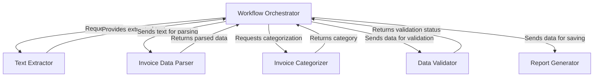

# 🧾 AI Invoice Management System

## 📌 Project Title
**AI Invoice Management System**

## 🎯 Objective
To automate the **extraction, categorization, validation**, and **reporting** of invoice details from both **text-based** and **scanned (image-based)** PDFs.

---

## 📖 Introduction

Manual entry of invoice data is tedious and error-prone, especially when invoices come in multiple formats like:
- Text-based PDFs
- Scanned image-based PDFs

This system uses **OCR** (Optical Character Recognition) and advanced **text extraction** techniques to automatically process invoices and convert them into structured, validated data.

---

## 💻 Technologies Used

| Technology   | Purpose                                  |
|--------------|-------------------------------------------|
| Python       | Core programming language                 |
| `pdfplumber` | Extract text from native PDFs             |
| `pdf2image`  | Convert scanned PDFs into images          |
| `pytesseract`| Perform OCR on images                     |
| `Pillow`     | Image preprocessing (e.g., grayscale)     |
| CSV          | Export structured data                    |

---

## 🔄 Workflow

1. **Input**: User uploads an invoice (`.pdf`)
2. **Text Extraction**:
   - ✅ If **text-based** PDF: Use `pdfplumber`
   - 📷 If **scanned**: Convert to image ➜ Use `pytesseract` (OCR)
3. **Preprocessing** *(for scanned PDFs)*:
   - Convert image to grayscale
   - Enhance contrast for better OCR
4. **Data Extraction**: Pull out:
   - Invoice Number
   - Invoice Date
   - Invoice Amount
   - Vendor Name
5. **Validation**: Ensure all fields are correctly captured
6. **Categorization**: Group by Vendor Name
7. **Reporting**: Export to `.csv`

---

## 🧠 Code Explanation

| File              | Function                                      |
|-------------------|-----------------------------------------------|
| `extract_data.py` | Text extraction or OCR from scanned invoices  |
| `process_data.py` | Extracts key invoice fields                   |
| `validate_data.py`| Verifies that required fields are present     |
| `categorize_data.py`| Categorizes invoices based on vendors       |
| `report_data.py`  | Saves processed data into a CSV               |
| `main.py`         | Coordinates and runs the entire workflow      |

---

## ✅ Advantages

- 🔁 **Automation** – Reduces manual data entry
- 🎯 **Accuracy** – Uses high-precision OCR & parsing
- ⚡ **Efficiency** – Quickly processes multiple invoices
- 📈 **Scalability** – Handles large batches with ease

---

## ⚠️ Limitations

- 🔍 **OCR accuracy** may vary based on scan quality
- 📐 **Complex layouts** (tables/columns) may require customization
- 🌐 **Language Support**: English only (for now)

---

## 🛠️ Setup Instructions

### 1. Install dependencies
```bash
pip install pdfplumber pdf2image pytesseract pillow
2. Install & configure Tesseract OCR
Download from: https://github.com/tesseract-ocr/tesseract

Add tesseract to your system PATH

project/
├── data/
│   └── invoices/    # Place your PDFs here
├── extract_data.py
├── process_data.py
├── validate_data.py
├── categorize_data.py
├── report_data.py
└── main.py

Edit
python3 main.py
📦 Final Output
✅ Structured CSV file with all invoice details

🐞 Debug logs during each processing step

🚀 Future Improvements
🤖 Integrate AI/ML for better field detection


# Tutorial: ai-invoicr-managent

This project, the **AI Invoice Management System**, *automates* the entire process of managing invoices. It can take both *regular text PDFs* and *scanned image PDFs*, intelligently extracting all the raw text from them. Then, it meticulously *parses* this text to pull out crucial details like invoice numbers, dates, and amounts. These extracted details are *validated* to ensure completeness and *categorized* based on vendors, before finally being organized and *reported* into an easy-to-use CSV file.


## Visual Overview



## Chapters

1. [Workflow Orchestrator
](01_workflow_orchestrator_.md)
2. [Text Extractor
](02_text_extractor_.md)
3. [Invoice Data Parser
](03_invoice_data_parser_.md)
4. [Data Validator
](04_data_validator_.md)
5. [Invoice Categorizer
](05_invoice_categorizer_.md)
6. [Report Generator
](06_report_generator_.md)

---

<sub><sup>Generated by [AI Codebase Knowledge Builder](https://github.com/The-Pocket/Tutorial-Codebase-Knowledge).</sup></sub>

📄 Extract detailed line-items from invoices

🌐 Build a web dashboard for uploads & analytics

📩 Contact
For support or feature requests, please raise an issue or contact the develo
