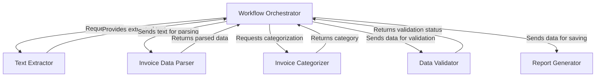
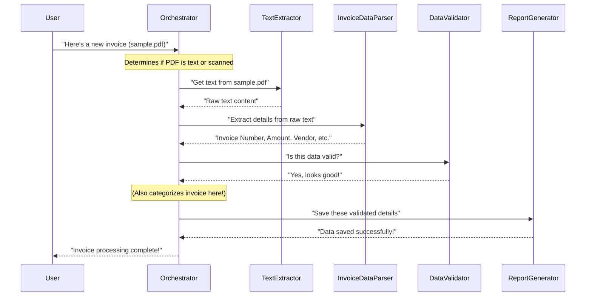
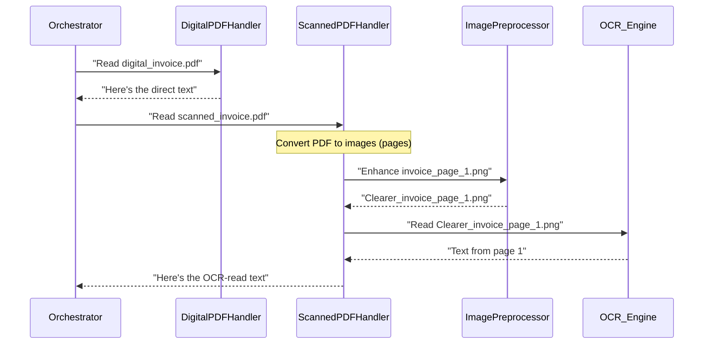
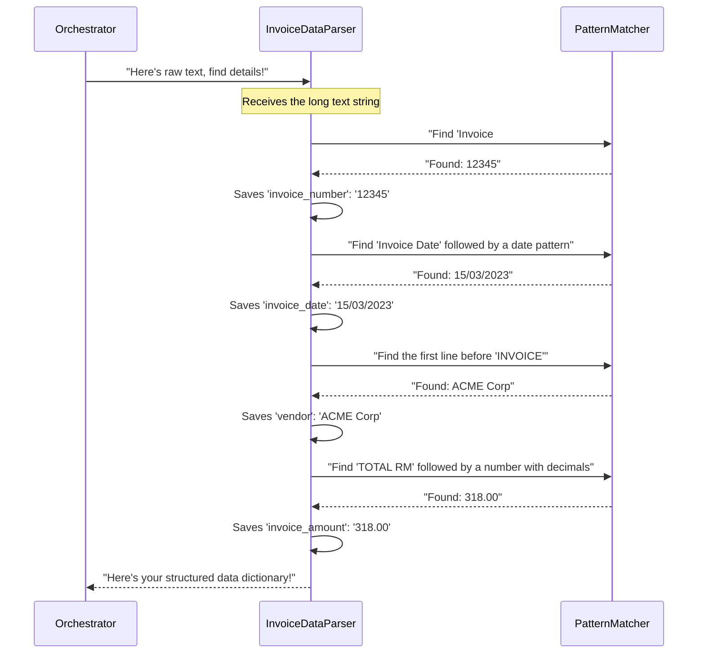
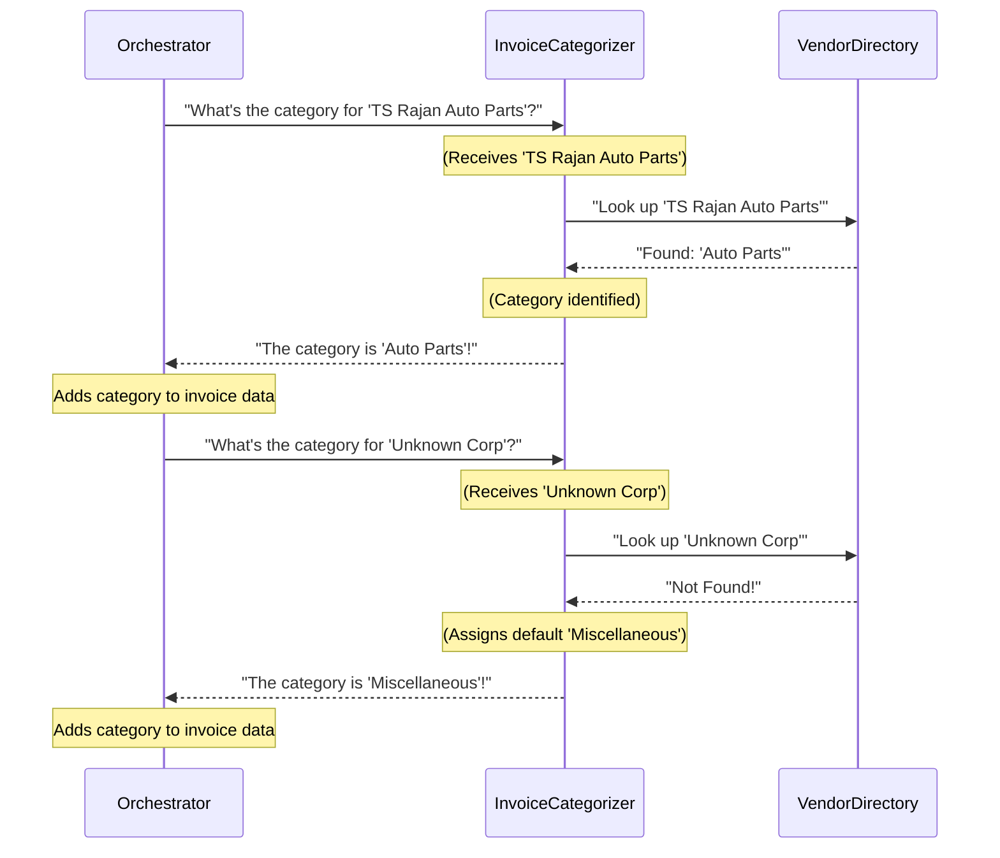
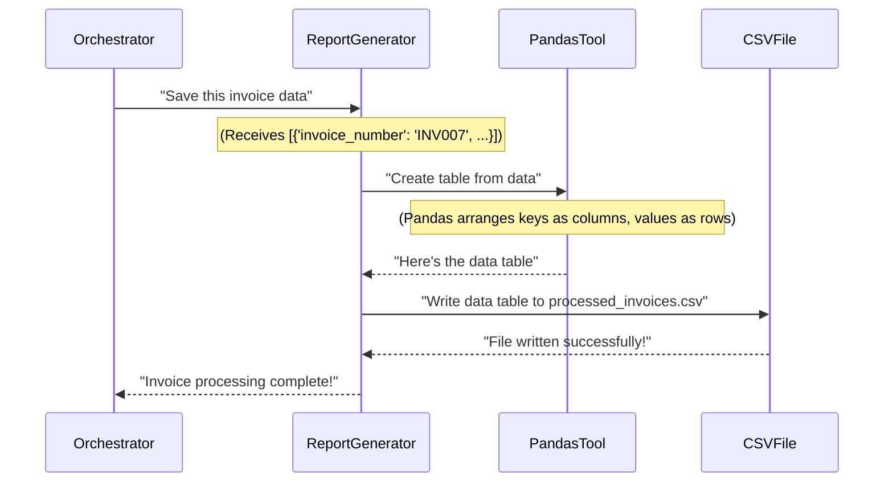

# 🧾 AI Invoice Management System

## 📌 Project Title
**AI Invoice Management System**

## 🎯 Objective
To automate the **extraction, categorization, validation**, and **reporting** of invoice details from both **text-based** and **scanned (image-based)** PDFs.

---

## 📖 Introduction

Manual entry of invoice data is tedious and error-prone, especially when invoices come in multiple formats like:
- Text-based PDFs
- Scanned image-based PDFs

This system uses **OCR** (Optical Character Recognition) and advanced **text extraction** techniques to automatically process invoices and convert them into structured, validated data.

---

## 💻 Technologies Used

| Technology   | Purpose                                  |
|--------------|-------------------------------------------|
| Python       | Core programming language                 |
| `pdfplumber` | Extract text from native PDFs             |
| `pdf2image`  | Convert scanned PDFs into images          |
| `pytesseract`| Perform OCR on images                     |
| `Pillow`     | Image preprocessing (e.g., grayscale)     |
| CSV          | Export structured data                    |

---

## 🔄 Workflow

1. **Input**: User uploads an invoice (`.pdf`)
2. **Text Extraction**:
   - ✅ If **text-based** PDF: Use `pdfplumber`
   - 📷 If **scanned**: Convert to image ➜ Use `pytesseract` (OCR)
3. **Preprocessing** *(for scanned PDFs)*:
   - Convert image to grayscale
   - Enhance contrast for better OCR
4. **Data Extraction**: Pull out:
   - Invoice Number
   - Invoice Date
   - Invoice Amount
   - Vendor Name
5. **Validation**: Ensure all fields are correctly captured
6. **Categorization**: Group by Vendor Name
7. **Reporting**: Export to `.csv`

---

## 🧠 Code Explanation

| File              | Function                                      |
|-------------------|-----------------------------------------------|
| `extract_data.py` | Text extraction or OCR from scanned invoices  |
| `process_data.py` | Extracts key invoice fields                   |
| `validate_data.py`| Verifies that required fields are present     |
| `categorize_data.py`| Categorizes invoices based on vendors       |
| `report_data.py`  | Saves processed data into a CSV               |
| `main.py`         | Coordinates and runs the entire workflow      |

---

## ✅ Advantages

- 🔁 **Automation** – Reduces manual data entry
- 🎯 **Accuracy** – Uses high-precision OCR & parsing
- ⚡ **Efficiency** – Quickly processes multiple invoices
- 📈 **Scalability** – Handles large batches with ease

---

## ⚠️ Limitations

- 🔍 **OCR accuracy** may vary based on scan quality
- 📐 **Complex layouts** (tables/columns) may require customization
- 🌐 **Language Support**: English only (for now)

---

## 🛠️ Setup Instructions

### 1. Install dependencies
```bash
pip install pdfplumber pdf2image pytesseract pillow
2. Install & configure Tesseract OCR
Download from: https://github.com/tesseract-ocr/tesseract

Add tesseract to your system PATH

project/
├── data/
│   └── invoices/    # Place your PDFs here
├── extract_data.py
├── process_data.py
├── validate_data.py
├── categorize_data.py
├── report_data.py
└── main.py

Edit
python3 main.py
📦 Final Output
✅ Structured CSV file with all invoice details

🐞 Debug logs during each processing step

🚀 Future Improvements
🤖 Integrate AI/ML for better field detection


# Tutorial: ai-invoicr-managent

This project, the **AI Invoice Management System**, *automates* the entire process of managing invoices. It can take both *regular text PDFs* and *scanned image PDFs*, intelligently extracting all the raw text from them. Then, it meticulously *parses* this text to pull out crucial details like invoice numbers, dates, and amounts. These extracted details are *validated* to ensure completeness and *categorized* based on vendors, before finally being organized and *reported* into an easy-to-use CSV file.


## Visual Overview



## Chapters

1. [Workflow Orchestrator
](01_workflow_orchestrator_.md)
2. [Text Extractor
](02_text_extractor_.md)
3. [Invoice Data Parser
](03_invoice_data_parser_.md)
4. [Data Validator
](04_data_validator_.md)
5. [Invoice Categorizer
](05_invoice_categorizer_.md)
6. [Report Generator
](06_report_generator_.md)

---

<sub><sup>Generated by [AI Codebase Knowledge Builder](https://github.com/The-Pocket/Tutorial-Codebase-Knowledge).</sup></sub>

📄 Extract detailed line-items from invoices

🌐 Build a web dashboard for uploads & analytics

📩 Contact
For support or feature requests, please raise an issue or contact the developer


# Chapter 1: Workflow Orchestrator

Welcome to the world of automated invoice management! In this first chapter, we're going to talk about a very important concept called the "Workflow Orchestrator." Don't let the fancy name scare you – it's actually quite simple and incredibly useful.

### What's the Big Idea? (The Problem)

Imagine you have a pile of invoices to process every day. Some are neat, digital PDFs that you can easily copy text from. Others are scans of paper invoices, which look like pictures, and you can't just copy text directly.

If you were doing this manually, you'd have to:
1.  **Pick up an invoice.**
2.  **Figure out:** Is it a clear text PDF or a blurry scanned image?
3.  **If text PDF:** Copy out the important details like invoice number, date, and amount.
4.  **If scanned image:** You'd have to *read* it like a human, then type out the details.
5.  **Categorize it:** "Oh, this is from 'Acme Corp', so it's an 'Office Supply' invoice."
6.  **Double-check:** Did I type everything correctly? Is anything missing?
7.  **Save it:** Put all the information into your spreadsheet or system.

This process is slow, boring, and very easy to make mistakes! Our `ai-invoicr-managent` project aims to automate all these steps. But how do we make sure all these different steps happen in the right order? That's where our "Workflow Orchestrator" comes in!

### Meet the Workflow Orchestrator: Your Project Manager

Think of the Workflow Orchestrator as the **central project manager** for processing an invoice. When a new invoice arrives, the Orchestrator takes charge. It doesn't do all the work itself, but it knows *who* should do *what* and *when*. It's like a conductor leading an orchestra, making sure each musician (each part of our system) plays their part at the right time to create beautiful music (a fully processed invoice!).

**Its main job is to:**
*   Receive an invoice.
*   Decide the first step (how to get text from it).
*   Hand off the invoice (or its text) to the next specialist for processing.
*   Keep track of the whole journey until the invoice is completely done and saved.

### How Does It Work in Our Project?

In our `ai-invoicr-managent` project, the **`main.py`** file is our Workflow Orchestrator. It contains the core logic that ties all the different parts together.

Let's look at a simplified example of how you would "tell" the Orchestrator to process an invoice:

```python
# main.py (simplified)

# Imagine these are functions from other parts of our system
# We'll learn about them in detail in later chapters!
def extract_text(pdf_path, is_scanned):
    # ... magic happens to get text ...
    print(f"Step 1: Text extracted from {pdf_path}")
    return "This is the raw text from the invoice."

def extract_details(raw_text):
    # ... more magic to find invoice number, date, etc. ...
    print("Step 2: Key details extracted.")
    return {"invoice_number": "INV001", "amount": 100.0}

def validate_data(details):
    # ... magic to check if details are valid ...
    print("Step 3: Data validated.")
    return True # No errors

def save_invoice(details):
    # ... magic to save details to a file ...
    print("Step 4: Invoice data saved.")

# This is our Orchestrator's main function
def process_invoice(pdf_file_path, is_scanned_pdf):
    print(f"Orchestrator starts processing: {pdf_file_path}")

    # 1. Get the text
    invoice_text = extract_text(pdf_file_path, is_scanned_pdf)

    # 2. Extract key details
    extracted_details = extract_details(invoice_text)

    # 3. Validate the details
    if validate_data(extracted_details):
        # 4. Save the processed invoice
        save_invoice(extracted_details)
        print("Orchestrator finished: Invoice fully processed!")
    else:
        print("Orchestrator finished: Found errors, stopping!")

# Example of how you'd use the Orchestrator:
if __name__ == "__main__":
    invoice_path = "data/invoices/sample_invoice.pdf"
    process_invoice(invoice_path, is_scanned_pdf=False)
```

**What's happening here?**

The `process_invoice` function is our Orchestrator in action.
1.  We give it the path to an invoice file (`invoice_path`) and tell it if it's a scanned PDF (`is_scanned_pdf`).
2.  The Orchestrator then calls `extract_text` to get the raw text. (This part of the work is done by the [Text Extractor](02_text_extractor_.md), which we'll explore in the next chapter!)
3.  Once it has the text, it sends it to `extract_details` to find the important bits like the invoice number and amount. (This is the job of the [Invoice Data Parser](03_invoice_data_parser_.md)).
4.  Then, it passes these extracted details to `validate_data` to ensure everything looks correct. (Done by the [Data Validator](04_data_validator_.md)).
5.  Finally, if all checks pass, it uses `save_invoice` to store the information. (This is handled by the [Report Generator](06_report_generator_.md)).

Notice how `process_invoice` itself doesn't know *how* to extract text or *how* to save data. It just knows *who* to ask for each specific task!

### The Orchestrator's Journey: A Step-by-Step Walkthrough

Let's visualize the journey of an invoice as it's processed by our Workflow Orchestrator.



In this diagram:
*   The **User** gives the invoice to the **Orchestrator**.
*   The **Orchestrator** acts as the central hub, passing the task to specialized components like the **Text Extractor**, **Invoice Data Parser**, **Data Validator**, and **Report Generator**.
*   Each component does its specific job and sends the result back to the **Orchestrator**.
*   The **Orchestrator** then decides the next step based on the previous result, ensuring a smooth flow from start to finish.

### Under the Hood: The Real `main.py`

Our project's `main.py` file is the actual Workflow Orchestrator. It imports functions from other files (`src/extract_data.py`, `src/process_data.py`, etc.) and calls them in the correct sequence.

Let's look at the actual code structure of the `process_invoice` function in `main.py`:

```python
# From main.py

# Import all the specialist functions
from src.extract_data import extract_text_from_pdf, ocr_pdf_to_text
from src.process_data import extract_invoice_data
from src.categorize_data import categorize_invoice
from src.validate_data import validate_data
from src.report_data import save_data_to_csv

def process_invoice(pdf_path, is_scanned=False):
    print(f"Processing invoice from: {pdf_path}")

    # Step 1: Extract data (calls Text Extractor)
    if is_scanned:
        print("Using OCR-based extraction...")
        text = ocr_pdf_to_text(pdf_path) # For scanned images
    else:
        print("Using regular text extraction...")
        text = extract_text_from_pdf(pdf_path) # For text PDFs
    
    print("\nExtracted Text (first few lines):\n", text[:200] + "...") # Show only a snippet

    # ... (more steps below)
```

**Explanation of this first part:**
*   We first import all the necessary "worker" functions from their respective files. This allows our Orchestrator to "call upon" them.
*   The `process_invoice` function takes the `pdf_path` and `is_scanned` as input.
*   It immediately makes a decision: If `is_scanned` is `True`, it uses `ocr_pdf_to_text` (for image-based PDFs); otherwise, it uses `extract_text_from_pdf` (for regular text PDFs). This is the Orchestrator routing the task to the correct [Text Extractor](02_text_extractor_.md).

Let's continue with the next steps of the Orchestrator:

```python
# From main.py (continued from above)

    # Step 2: Process data to get key fields (calls Invoice Data Parser)
    invoice_data = extract_invoice_data(text)
    print("\nExtracted invoice data:", invoice_data)

    # Step 3: Categorize the invoice (calls Invoice Categorizer)
    if invoice_data.get('vendor') and invoice_data['vendor'] != 'Missing':
        invoice_data['category'] = categorize_invoice(invoice_data['vendor'])
    else:
        invoice_data['category'] = 'Uncategorized'
    print(f"Invoice category assigned: {invoice_data['category']}")

    # Step 4: Validate the extracted data (calls Data Validator)
    errors = validate_data(invoice_data)
    if errors:
        print("Validation errors:", errors)
        return # Stop processing if there are errors

    # Step 5: Save the data to CSV (calls Report Generator)
    save_data_to_csv([invoice_data])
    print(f"\nProcessed and saved invoice data for Invoice Number: {invoice_data['invoice_number']}")
```

**Explanation of this second part:**
*   After getting the raw text, the Orchestrator passes it to `extract_invoice_data` from `src/process_data.py`. This is the [Invoice Data Parser](03_invoice_data_parser_.md) getting busy!
*   Then, it takes the extracted data and sends the vendor name to `categorize_invoice` from `src/categorize_data.py`. This is the [Invoice Categorizer](05_invoice_categorizer_.md) at work.
*   Next, it calls `validate_data` from `src/validate_data.py`. This is the [Data Validator](04_data_validator_.md) making sure everything is correct. If there are errors, the Orchestrator stops!
*   Finally, if all steps are successful, it calls `save_data_to_csv` from `src/report_data.py`. This is the [Report Generator](06_report_generator_.md) creating the final output.

As you can see, the `main.py` file really is the "brain" or the "central project manager" that coordinates all the different specialized parts of our system to process an invoice from start to finish.

### Conclusion

You've learned that the Workflow Orchestrator is like the project manager of our invoice processing system. Its job is to coordinate all the different steps—from getting the text out of an invoice to finally saving the processed details—making sure everything happens in the correct order. It doesn't do the individual tasks itself, but it knows which specialized component is responsible for each part of the work.

In the next chapter, we'll dive into the very first task the Orchestrator delegates: getting the text out of an invoice. This is handled by the [Text Extractor](02_text_extractor_.md)!


# Chapter 2: Text Extractor

Welcome back! In our last chapter, we met the [Workflow Orchestrator](01_workflow_orchestrator_.md), which acts as the project manager for processing invoices. It knows *who* should do *what* and *when*. The very first task the Orchestrator gives out is to get the actual words and numbers from an invoice document. This crucial job is handled by our **Text Extractor**.

### What's the Challenge of Reading an Invoice?

Imagine you have two invoices:
1.  **Invoice A:** A perfectly digital PDF file that was generated by a computer. You can easily highlight and copy text from it using your mouse.
2.  **Invoice B:** A scanned image of a paper invoice. It looks like a picture. If you try to highlight text, you can't! It's just one big image. To get the information, you'd have to *read* it with your eyes and then type it out.

Our `ai-invoicr-managent` system needs to handle both types automatically. How can a computer "read" both a digital document and a picture of a document? This is the problem the Text Extractor solves!

### Meet the Text Extractor: Your Invoice's Smart Reader

Think of the **Text Extractor** as a highly skilled "reader" in our system. Its main goal is to get *all* the words and numbers from any invoice PDF, no matter if it's a digital file or a scanned image.

It has two specialized ways of "reading":

1.  **For Digital Text PDFs:**
    *   If the PDF contains actual digital text (like Invoice A above), the Text Extractor simply and efficiently pulls out all the words directly. It's like copying and pasting directly from the document. This is fast and very accurate.

2.  **For Scanned Image PDFs (or photos of invoices):**
    *   If the PDF is a scanned image (like Invoice B), the Text Extractor first needs to do some extra work. It turns that image into a clearer, grayscale version to make it easier to read.
    *   Then, it uses a special technology called **Optical Character Recognition (OCR)**. You can imagine OCR as a super-smart magnifying glass that looks at the shapes of characters in the image and converts them into digital text. It literally "reads" the letters and numbers from the picture. This process is a bit more complex but allows us to handle image-based invoices.

**Its primary role is to ensure all textual content from any PDF invoice is accurately obtained for further processing by other parts of our system.**

### How the Orchestrator Uses the Text Extractor

Remember from [Chapter 1: Workflow Orchestrator](01_workflow_orchestrator_.md) that the Orchestrator (`main.py`) makes decisions. When a new invoice arrives, one of its first decisions is: "Is this a digital PDF or a scanned image?" Based on that, it tells the Text Extractor *how* to read the document.

Let's look at a simplified version of how the Orchestrator (`main.py`) calls the Text Extractor:

```python
# main.py (simplified for Text Extractor focus)
# We import the tools for text extraction from extract_data.py
from src.extract_data import extract_text_from_pdf, ocr_pdf_to_text

def get_invoice_text(pdf_path, is_scanned=False):
    print(f"Text Extractor is analyzing: {pdf_path}")
    if is_scanned:
        print("Invoice is scanned. Using OCR (magnifying glass) mode.")
        text_content = ocr_pdf_to_text(pdf_path) # Call OCR tool
    else:
        print("Invoice is digital. Extracting text directly.")
        text_content = extract_text_from_pdf(pdf_path) # Call direct text tool
    
    return text_content[:200] + "..." # Return a snippet of the text

# --- Example Usage ---
# Scenario 1: Digital PDF
digital_invoice_text = get_invoice_text("data/invoices/sample_invoice.pdf", is_scanned=False)
print(f"\nExtracted digital text snippet: \n'{digital_invoice_text}'")

# Scenario 2: Scanned PDF
scanned_invoice_text = get_invoice_text("data/invoices/scanned_invoice.pdf", is_scanned=True)
print(f"\nExtracted scanned text snippet: \n'{scanned_invoice_text}'")
```

**What's happening here?**

*   The `get_invoice_text` function (which is part of our Orchestrator's logic) receives the `pdf_path` and a flag `is_scanned`.
*   It then checks `is_scanned`.
    *   If `True`, it calls `ocr_pdf_to_text`, which is our OCR specialist.
    *   If `False`, it calls `extract_text_from_pdf`, which is our direct text specialist.
*   In both cases, it returns the raw text content from the invoice.

### Under the Hood: How the Text Extractor Works

Let's see how our Text Extractor actually performs its two different reading methods.

#### Step-by-Step Walkthrough



In this diagram:
*   The **Orchestrator** tells the appropriate Text Extractor part to read the invoice.
*   For **Digital PDFs**, a specialized `DigitalPDFHandler` quickly gets the text.
*   For **Scanned PDFs**, a `ScannedPDFHandler` first converts the PDF pages into images.
*   Then, it sends each image to an `ImagePreprocessor` to make it clearer (like adjusting contrast).
*   Finally, the preprocessed image goes to the `OCR_Engine` (our "magnifying glass") to convert the image characters into digital text, which is then returned.

#### Diving into the Code (`src/extract_data.py`)

All the magic of the Text Extractor lives in the `src/extract_data.py` file. This file contains the functions that the Orchestrator calls.

Let's look at the simple way of extracting text from a *digital* PDF:

```python
# src/extract_data.py (Part 1: Digital Text Extraction)
import pdfplumber # A Python tool to work with PDFs

def extract_text_from_pdf(pdf_path):
    # Open the PDF file
    with pdfplumber.open(pdf_path) as pdf:
        text = ""
        # Go through each page of the PDF
        for page in pdf.pages:
            # Extract text from the current page and add to our total
            text += page.extract_text()
    return text
```

**Explanation:**
*   We use a library called `pdfplumber`. It's really good at reading digital PDF documents.
*   The `extract_text_from_pdf` function opens the PDF, goes page by page, and collects all the digital text it finds. Simple as that!

Now, let's look at the more involved process for *scanned* PDFs, which uses OCR. This requires a few more steps:

```python
# src/extract_data.py (Part 2: OCR - Image Preprocessing)
from PIL import Image, ImageEnhance # Tools for image manipulation

def preprocess_image(image):
    # Convert the image to grayscale (black and white)
    image = image.convert('L') # 'L' means grayscale
    
    # Enhance the contrast to make text stand out more
    enhancer = ImageEnhance.Contrast(image)
    image = enhancer.enhance(2.0) # We increase contrast by a factor of 2
    
    return image
```

**Explanation:**
*   The `preprocess_image` function takes an image (a page from our scanned PDF).
*   First, it turns the image into grayscale (black and white). This removes colors that might confuse the OCR engine.
*   Then, it boosts the contrast, making the text darker and the background lighter. This helps the OCR "magnifying glass" see the characters more clearly, especially if the original scan wasn't perfect.

Finally, how we bring it all together for OCR:

```python
# src/extract_data.py (Part 3: OCR - PDF to Image and Text)
import pytesseract # The OCR engine itself
from pdf2image import convert_from_path # Tool to turn PDF pages into images

# (preprocess_image function defined above)

def ocr_pdf_to_text(pdf_path):
    # Convert the entire PDF into a list of images (one image per page)
    images = convert_from_path(pdf_path)
    
    text = ''
    # Go through each image (page)
    for image in images:
        # First, make the image clearer for OCR
        preprocessed_image = preprocess_image(image)
        
        # Now, use the Tesseract OCR engine to read text from the image
        ocr_text = pytesseract.image_to_string(preprocessed_image)
        
        # Add the text from this page to our total
        text += ocr_text
    
    return text
```

**Explanation:**
*   The `ocr_pdf_to_text` function is the main OCR coordinator.
*   It uses `convert_from_path` to turn each page of the PDF into an image.
*   For each of these images, it first calls our `preprocess_image` function to clean it up.
*   Then, it hands the cleaned image to `pytesseract.image_to_string`. `pytesseract` is a Python "wrapper" for the powerful Tesseract OCR engine. It does the actual character recognition.
*   The recognized text from each page is collected, and finally, all the text from the entire scanned PDF is returned.

#### Comparing the "Reading" Methods

| Feature                | Digital Text PDFs (using `pdfplumber`)              | Scanned Image PDFs (using `pdf2image`, `Pillow`, `pytesseract`) |
| :--------------------- | :-------------------------------------------------- | :---------------------------------------------------------------- |
| **Input**              | PDF with actual digital text                        | PDF that is essentially an image (scan)                           |
| **Steps**              | Direct text extraction                              | Convert PDF to images -> Preprocess images -> OCR                 |
| **Accuracy**           | Very High (perfect, as text is already digital)     | High (depends on scan quality and text clarity)                   |
| **Speed**              | Very Fast                                           | Slower (more steps involved, image processing and OCR take time)  |
| **Analogy**            | Copy-pasting directly                               | Reading with a magnifying glass and typing it out                 |

### Conclusion

You've now seen how the **Text Extractor** acts as our system's versatile reader. It expertly handles both perfectly digital invoices by directly extracting text and image-based scanned invoices by using image preprocessing and powerful OCR technology. This ensures that no matter the format, we always get the raw textual content needed for our next steps.

With the text successfully extracted, what comes next? Our Orchestrator will hand this raw text over to the next specialist, who will search through it to find the specific important pieces of information like the invoice number, date, and amount. This is the job of the [Invoice Data Parser](03_invoice_data_parser_.md)!


# Chapter 3: Invoice Data Parser

Welcome back! In our last chapter, [Chapter 2: Text Extractor](02_text_extractor_.md), we saw how our system could magically "read" any invoice PDF—whether it was a clean digital file or a scanned image—and give us all the words and numbers as one long block of text. This raw text is a huge step, but it's still just a jumble of information.

### What's the Problem with Just Raw Text?

Imagine you have this block of text from an invoice:

```
ACME Corp
123 Business Lane
City, Country

INVOICE

Invoice # 12345
Date: 15/03/2023
Customer ID: CUST001

Description          Qty  Unit Price  Amount
Office Supplies      2    50.00       100.00
Consulting Services  1    200.00      200.00

Subtotal: 300.00
Tax (6%): 18.00
TOTAL RM 318.00
```

For a human, it's easy to spot:
*   The **Invoice Number** is "12345".
*   The **Invoice Date** is "15/03/2023".
*   The **Vendor** (who sent the invoice) is "ACME Corp".
*   The **Total Amount** is "RM 318.00".

But for a computer, this is just a string of characters. It doesn't inherently understand what "Invoice #" means or that "318.00" is the important total amount. We need a way to teach our system to be smart like a human and pick out these key pieces of information.

This is exactly the problem our **Invoice Data Parser** solves!

### Meet the Invoice Data Parser: Your Meticulous Detective

Think of the **Invoice Data Parser** as a highly trained detective. Its job is to meticulously sift through the long, raw text that the [Text Extractor](02_text_extractor_.md) provides and pinpoint *specific, crucial pieces of information*. It uses a "mental checklist" of patterns to search for things like the invoice number, the date, the vendor's name, and the total amount.

**Its main goal is to transform that messy block of text into a neat, structured set of data points.** This structured data is then much easier for our system to understand, validate, and use.

For our example text above, the Parser would aim to convert it into something like this:

```json
{
  "invoice_number": "12345",
  "invoice_date": "15/03/2023",
  "vendor": "ACME Corp",
  "invoice_amount": "318.00"
}
```

Much cleaner, right?

### How the Orchestrator Uses the Invoice Data Parser

Remember our [Workflow Orchestrator](01_workflow_orchestrator_.md) (`main.py`)? After the [Text Extractor](02_text_extractor_.md) has done its job and handed over the raw text, the Orchestrator's next step is to call upon our Invoice Data Parser.

Here's how that looks in our `main.py` file:

```python
# From main.py (simplified)

# First, the Text Extractor has already given us 'text'
# text = "ACME Corp\n...\nTOTAL RM 318.00" # This is the raw text

# Import our Invoice Data Parser specialist
from src.process_data import extract_invoice_data

def process_invoice_part_2(text):
    print("\nOrchestrator hands text to Invoice Data Parser...")
    
    # Step 2: Process data to get key fields
    invoice_data = extract_invoice_data(text)
    
    print("Invoice Data Parser found these details:")
    print(invoice_data)
    
    return invoice_data

# Example of using this part:
raw_invoice_text = """
ACME Corp
123 Business Lane
City, Country

INVOICE

Invoice # 12345
Date: 15/03/2023
Customer ID: CUST001

Description          Qty  Unit Price  Amount
Office Supplies      2    50.00       100.00
Consulting Services  1    200.00      200.00

Subtotal: 300.00
Tax (6%): 18.00
TOTAL RM 318.00
"""

# Imagine this is the raw text from Chapter 2
processed_data = process_invoice_part_2(raw_invoice_text)
# Expected Output:
# Invoice Data Parser found these details:
# {'invoice_number': '12345', 'invoice_date': '15/03/2023', 'vendor': 'ACME Corp', 'invoice_amount': '318.00'}
```

As you can see, the `process_invoice_part_2` function (which is part of our `main.py` Orchestrator) simply calls `extract_invoice_data` and passes it the entire raw text. The Parser then works its magic and returns a neat Python dictionary containing all the extracted details.

### Under the Hood: The Detective's Toolkit

How does our Invoice Data Parser actually perform its detective work? It uses a powerful technique called **Regular Expressions (Regex)**. Think of Regex as a special language for describing text patterns. It's like telling the detective: "Look for the words 'Invoice #' followed by some numbers."

#### Step-by-Step Walkthrough

Let's visualize the detective's process:



In this diagram:
*   The **Orchestrator** sends the raw text to the **InvoiceDataParser**.
*   The **InvoiceDataParser** then uses its internal **PatternMatcher** (which is our Regex tool) to search for each specific piece of information.
*   As it finds each detail, it stores it in a temporary list (which will become our Python dictionary).
*   Finally, once all relevant details are found, it sends the complete, structured data back to the **Orchestrator**.

#### Diving into the Code (`src/process_data.py`)

All the detective work, specifically the pattern matching with Regex, is handled by the `extract_invoice_data` function in the `src/process_data.py` file.

Let's break down how it finds each piece of information:

First, we need the `re` (regular expression) library in Python:

```python
# src/process_data.py (Part 1: Setting up)
import re # This is Python's tool for Regular Expressions

def extract_invoice_data(text):
    invoice_data = {} # This will store all our findings
    
    # ... (patterns for finding data will go here)
    
    return invoice_data
```

Now, let's see how it finds the **Invoice Number**:

```python
# src/process_data.py (Part 2: Invoice Number)
# (Inside the extract_invoice_data function)

    # Search for "Invoice #" followed by numbers
    # r'Invoice\s*#\s*(\d+)' means:
    # 'Invoice' - literally the word "Invoice"
    # '\s*' - zero or more spaces
    # '#' - literally the hash symbol
    # '(\d+)' - capture one or more digits (this is our invoice number!)
    invoice_no_match = re.search(r'Invoice\s*#\s*(\d+)', text, re.IGNORECASE)
    invoice_data['invoice_number'] = invoice_no_match.group(1) if invoice_no_match else 'Missing'
```

**Explanation:**
*   `re.search` looks for the pattern in the `text`.
*   The pattern `r'Invoice\s*#\s*(\d+)'` is designed to find "Invoice #", allowing for any number of spaces (`\s*`) around the hash symbol, and then it captures the actual invoice number (`\d+` means one or more digits).
*   `re.IGNORECASE` means it will find "invoice #" or "INVOICE #".
*   If a match is found (`invoice_no_match`), `group(1)` retrieves the captured part (the actual digits). If not, it saves 'Missing'.

Next, finding the **Invoice Date**:

```python
# src/process_data.py (Part 3: Invoice Date)
# (Inside the extract_invoice_data function)

    # Search for "Invoice Date" followed by a specific date format (DD/MM/YYYY)
    # r'Invoice\s*Date\s*(\d{2}/\d{2}/\d{4})' means:
    # 'Invoice Date' - literally the phrase
    # '\s*' - zero or more spaces
    # '(\d{2}/\d{2}/\d{4})' - capture two digits / two digits / four digits (our date!)
    date_match = re.search(r'Invoice\s*Date\s*(\d{2}/\d{2}/\d{4})', text, re.IGNORECASE)
    invoice_data['invoice_date'] = date_match.group(1) if date_match else 'Missing'
```

**Explanation:**
*   This pattern looks for "Invoice Date" and then specifically captures a date in the `DD/MM/YYYY` format using `\d{2}/\d{2}/\d{4}`.

Now, let's find the **Vendor Name**:

```python
# src/process_data.py (Part 4: Vendor Name)
# (Inside the extract_invoice_data function)

    # Search for the first line that appears before the word "INVOICE"
    # r'^(.+?)\s+INVOICE' means:
    # '^' - start of a line (because of re.MULTILINE)
    # '(.+?)' - capture any characters ('anything goes') non-greedily
    # '\s+' - one or more spaces
    # 'INVOICE' - the word "INVOICE"
    vendor_match = re.search(r'^(.+?)\s+INVOICE', text, re.IGNORECASE | re.MULTILINE)
    invoice_data['vendor'] = vendor_match.group(1).strip() if vendor_match else 'Missing'
```

**Explanation:**
*   This pattern uses `^` (start of line) and `re.MULTILINE` to look for lines. It captures everything on a line (`.+?`) until it hits the word "INVOICE". This often helps find the company name at the top of the invoice.
*   `.strip()` removes any extra spaces from the beginning or end of the captured vendor name.

Finally, the **Total Amount**:

```python
# src/process_data.py (Part 5: Total Amount)
# (Inside the extract_invoice_data function)

    # Search for "TOTAL RM" followed by a number that includes commas and decimals
    # r'TOTAL\s+RM\s*([\d,]+\.\d{2})' means:
    # 'TOTAL RM' - literally the phrase
    # '\s*' - zero or more spaces
    # '([\d,]+\.\d{2})' - capture one or more digits or commas, then a dot, then two digits (our amount!)
    amount_match = re.search(r'TOTAL\s+RM\s*([\d,]+\.\d{2})', text, re.IGNORECASE)
    invoice_data['invoice_amount'] = amount_match.group(1).replace(',', '') if amount_match else 'Missing'
```

**Explanation:**
*   This pattern specifically looks for "TOTAL RM" and then captures a number that could have commas (like "1,234.56") and must have two decimal places (`.d{2}`).
*   `.replace(',', '')` removes any commas from the number, so it can be easily converted to a proper number later if needed.

By chaining these specific patterns, our Invoice Data Parser systematically extracts all the necessary details from the raw text.

### Conclusion

You've learned that the **Invoice Data Parser** is like our system's meticulous detective. It takes the raw, unstructured text from the [Text Extractor](02_text_extractor_.md) and uses powerful patterns (Regular Expressions) to find and pull out specific, crucial pieces of information like the invoice number, date, vendor, and total amount. It transforms messy text into a clean, structured dictionary of data, ready for the next steps.

What are those next steps? With the data extracted, the Orchestrator will then hand this structured data over to another specialist to make sure everything looks correct and valid. This is the job of the [Data Validator](04_data_validator_.md)!

---

Chapter 4: Data Validator
Welcome back! In our last chapter, Chapter 3: Invoice Data Parser, we saw how our system's "detective" meticulously extracted key pieces of information (like invoice number, date, vendor, and total amount) from the raw invoice text. It transformed messy text into a neat, structured dictionary of data.

But what if our detective, despite its best efforts, couldn't find all the essential pieces of information? Imagine an invoice where the total amount is blurry, or the invoice number is missing. If we simply save this incomplete data, it could lead to big problems later – wrong financial records, difficulty tracking payments, or frustrated users. We need a way to ensure that only complete and reliable invoice data moves forward in our system.

This is where our Data Validator comes in!

Meet the Data Validator: Your Quality Control Inspector
Think of the Data Validator as a strict but fair quality control inspector for our extracted invoice details. After the Invoice Data Parser has done its job of finding all the key pieces of information, the Data Validator steps in to perform a quick but critical check.

Its main job is to:

Check the essentials: Look at the extracted data (the dictionary we got from the Parser).
Verify completeness: Make sure that all the absolutely essential fields (like invoice number, date, total amount, and vendor name) are actually present and haven't been marked as "Missing."
Flag errors: If any of these critical pieces of information are missing, it immediately flags an error.
By doing this, the Data Validator ensures that only complete and reliable invoice data proceeds through our system, preventing incomplete records from ever being saved. It's like checking a shipping label before sending a package – you wouldn't want to send it if the address is missing!

How the Orchestrator Uses the Data Validator
Remember our Workflow Orchestrator (main.py)? After the Invoice Data Parser hands over the structured invoice_data, the Orchestrator's very next move is to pass this data to our Data Validator. It wants to know: "Is this data good enough to proceed?"

Here's how that looks in our main.py file:

# From main.py (simplified)

# 'invoice_data' is what we got from the Invoice Data Parser
# Example: {'invoice_number': '12345', 'invoice_date': '15/03/2023', 'vendor': 'ACME Corp', 'invoice_amount': '318.00'}
# OR an incomplete one: {'invoice_number': 'Missing', 'invoice_date': '15/03/2023', 'vendor': 'ACME Corp', 'invoice_amount': '318.00'}

# Import our Data Validator specialist
from src.validate_data import validate_data

def process_invoice_part_3(invoice_data):
    print("\nOrchestrator sends data to Data Validator...")
    
    # Step 4: Validate the extracted data
    errors = validate_data(invoice_data) # The validator does its check
    
    if errors:
        print("Validation errors found! Invoice processing stopped.")
        for error in errors:
            print(f"- {error}")
        return False # Indicate that validation failed
    else:
        print("Data Validator: All essential fields are present and look good!")
        return True # Indicate that validation passed

# Example of using this part with good data:
good_invoice = {'invoice_number': '12345', 'invoice_date': '15/03/2023', 'vendor': 'ACME Corp', 'invoice_amount': '318.00'}
print("--- Testing good data ---")
process_invoice_part_3(good_invoice)

# Example with missing data:
bad_invoice = {'invoice_number': 'Missing', 'invoice_date': '15/03/2023', 'vendor': 'ACME Corp', 'invoice_amount': '318.00'}
print("\n--- Testing bad data (missing invoice number) ---")
process_invoice_part_3(bad_invoice)
What's happening here?

The process_invoice_part_3 function (part of our Orchestrator) receives the invoice_data dictionary.
It calls the validate_data function, which is our Data Validator.
The validate_data function returns a list of errors. If this list is empty, it means everything passed!
If errors is not empty, the Orchestrator stops processing this invoice, preventing incomplete or unreliable data from moving forward. This is a critical checkpoint!
Under the Hood: The Inspector's Checklist
How does our Data Validator actually perform its quality check? It has a simple but effective checklist of fields that are absolutely required for every invoice. It iterates through this list and checks if each field has a valid value (i.e., not "Missing").

Step-by-Step Walkthrough
Let's visualize the Data Validator's inspection process:

sequenceDiagram
    participant Orchestrator
    participant DataValidator
    participant InvoiceData

    Orchestrator->>DataValidator: "Inspect this invoice data"
    Note over DataValidator: (Receives {'invoice_number': '12345', 'invoice_date': 'Missing', 'vendor': 'Acme', 'invoice_amount': '318.00'})

    DataValidator->>InvoiceData: "Check 'invoice_number'?"
    InvoiceData-->>DataValidator: "Value: '12345'"
    Note over DataValidator: OK!

    DataValidator->>InvoiceData: "Check 'invoice_date'?"
    InvoiceData-->>DataValidator: "Value: 'Missing'"
    Note over DataValidator: NOT OK! Add "Missing invoice date" to errors.

    DataValidator->>InvoiceData: "Check 'vendor'?"
    InvoiceData-->>DataValidator: "Value: 'Acme'"
    Note over DataValidator: OK!

    DataValidator->>InvoiceData: "Check 'invoice_amount'?"
    InvoiceData-->>DataValidator: "Value: '318.00'"
    Note over DataValidator: OK!

    DataValidator-->>Orchestrator: "Here are the errors: ['Missing invoice date']"
In this diagram:

The Orchestrator sends the extracted invoice_data dictionary to the DataValidator.
The DataValidator goes through its internal checklist of required fields one by one.
For each field, it retrieves the value from InvoiceData (our dictionary).
If a value is found to be Missing (or empty, which we treat as missing), it adds a specific error message to its list of errors.
Finally, the DataValidator returns the complete list of errors back to the Orchestrator.
Diving into the Code (src/validate_data.py)
All the checking logic for the Data Validator lives in the validate_data function inside the src/validate_data.py file.

Let's look at the actual code:

# src/validate_data.py

def validate_data(invoice_data):
    errors = [] # This list will hold any problems we find

    # Check if 'invoice_number' is present and not 'Missing'
    if not invoice_data.get('invoice_number') or invoice_data.get('invoice_number') == 'Missing':
        errors.append("Missing invoice number")

    # Check if 'invoice_date' is present and not 'Missing'
    if not invoice_data.get('invoice_date') or invoice_data.get('invoice_date') == 'Missing':
        errors.append("Missing invoice date")

    # Check if 'invoice_amount' is present and not 'Missing'
    if not invoice_data.get('invoice_amount') or invoice_data.get('invoice_amount') == 'Missing':
        errors.append("Missing invoice amount")

    # Check if 'vendor' is present and not 'Missing'
    if not invoice_data.get('vendor') or invoice_data.get('vendor') == 'Missing':
        errors.append("Missing vendor name")
        
    return errors # Return the list of any errors found
Explanation:

The validate_data function takes invoice_data (the dictionary of extracted details) as input.
It starts with an empty list called errors.
For each critical field (invoice_number, invoice_date, invoice_amount, vendor):
It uses invoice_data.get('field_name'). The .get() method is safe because if a field doesn't exist in the dictionary, it returns None instead of causing an error.
The condition not invoice_data.get('field_name') checks if the value is None (meaning the key wasn't even present) or an empty string.
The condition invoice_data.get('field_name') == 'Missing' explicitly checks if the Invoice Data Parser couldn't find the data and marked it as "Missing".
If either of these conditions is true, it means the field is considered missing or invalid, and an appropriate error message is added to the errors list.
Finally, the function returns the errors list. If the list is empty, it means all required fields were found and considered valid!
This simple but effective logic makes sure that our system always works with the highest quality of extracted data, preventing issues that might arise from incomplete information.

Conclusion
You've learned that the Data Validator is our system's essential quality control inspector. It steps in after data extraction to ensure that all critical fields—like the invoice number, date, amount, and vendor—are present and not marked as "Missing." By flagging errors for incomplete data, it acts as a crucial gatekeeper, ensuring that only reliable and complete invoice information continues through our workflow.

With our invoice data now extracted and thoroughly validated, the Orchestrator has another task: to figure out what type of invoice it is. Is it for office supplies? Travel? Utilities? This is the job of the Invoice Categorizer!


# Chapter 5: Invoice Categorizer

Welcome back! In our last chapter, [Chapter 4: Data Validator](04_data_validator_.md), we ensured that all the important details extracted from an invoice (like the invoice number, date, vendor, and amount) were present and correct. Our quality control inspector gave the data a big thumbs-up!

Now that we have clean, reliable invoice data, what's the next step? Imagine you're trying to manage your monthly expenses. You have a pile of invoices, all with correct details, but they're still just individual pieces of paper. It's hard to tell at a glance how much you spent on "food" versus "auto parts" last month. To truly understand your spending, you need to group these invoices into meaningful categories.

This is exactly the problem our **Invoice Categorizer** solves!

### Meet the Invoice Categorizer: Your Specialized Librarian

Think of the **Invoice Categorizer** as a highly organized and specialized librarian for your invoices. Its job is not just to store information, but to put each invoice into the correct "shelf" or **category** based on who sent it (the vendor).

Once the [Invoice Data Parser](03_invoice_data_parser_.md) successfully identifies the vendor's name, our Categorizer takes that name and:
1.  **Looks it up:** It checks its internal "directory" (a predefined list of vendors and their categories).
2.  **Assigns a category:** If it finds the vendor, it assigns a specific category (e.g., 'Auto Parts', 'Food', 'Driving Services') to the invoice. This automatically organizes your expenses into meaningful groups.
3.  **Handles unknowns:** If the vendor is *not* recognized in its directory, it smartly assigns a default 'Miscellaneous' category. This ensures no invoice is left uncategorized.

This automatic categorization makes it super easy to track and analyze your spending, helping you answer questions like, "How much did I spend on car repairs last quarter?" or "What's my biggest expense category?"

### How the Orchestrator Uses the Invoice Categorizer

Remember our [Workflow Orchestrator](01_workflow_orchestrator_.md) (`main.py`)? After the [Data Validator](04_data_validator_.md) confirms the invoice data is good to go, the Orchestrator's next task is to send this data, specifically the vendor's name, to our Invoice Categorizer. It asks: "What category does this invoice belong to?"

Here's how that looks in our `main.py` file:

```python
# From main.py (simplified)

# 'invoice_data' is what we got from the Data Validator, e.g.:
# {'invoice_number': '12345', 'invoice_date': '15/03/2023', 'vendor': 'TS Rajan Auto Parts', 'invoice_amount': '318.00'}

# Import our Invoice Categorizer specialist
from src.categorize_data import categorize_invoice

def process_invoice_part_4(invoice_data):
    print("\nOrchestrator sends vendor name to Invoice Categorizer...")
    
    # Step 3: Categorize the invoice (happens after parsing/validation in our full flow)
    # We only try to categorize if we actually found a vendor name
    if invoice_data.get('vendor') and invoice_data['vendor'] != 'Missing':
        # Call the categorizer
        invoice_data['category'] = categorize_invoice(invoice_data['vendor'])
    else:
        # If no vendor was found (or it was 'Missing'), assign a default category
        invoice_data['category'] = 'Uncategorized'
        
    print(f"Invoice category assigned: {invoice_data['category']}")
    
    return invoice_data

# Example of using this part:
invoice_with_vendor = {
    'invoice_number': '12345', 
    'invoice_date': '15/03/2023', 
    'vendor': 'TS Rajan Auto Parts', 
    'invoice_amount': '318.00'
}
print("--- Categorizing a known vendor ---")
processed_data = process_invoice_part_4(invoice_with_vendor)
# Expected Output: Invoice category assigned: Auto Parts

invoice_with_unknown_vendor = {
    'invoice_number': '67890', 
    'invoice_date': '20/04/2023', 
    'vendor': 'New Bookstore Inc.', 
    'invoice_amount': '55.00'
}
print("\n--- Categorizing an unknown vendor ---")
processed_data_unknown = process_invoice_part_4(invoice_with_unknown_vendor)
# Expected Output: Invoice category assigned: Miscellaneous
```

**What's happening here?**

*   The `process_invoice_part_4` function (part of our Orchestrator) receives the `invoice_data` dictionary.
*   It first checks if a `vendor` name exists and isn't 'Missing'. This is a smart check to avoid trying to categorize an invoice with no known sender.
*   It then calls the `categorize_invoice` function, passing it just the `vendor` name.
*   The result (the category) is then added back into our `invoice_data` dictionary.
*   If the vendor was missing, it directly assigns 'Uncategorized'.

### Under the Hood: The Librarian's Directory

How does our Invoice Categorizer know which category to assign? It uses a simple but effective internal "directory" or a lookup table that maps vendor names to their respective categories.

#### Step-by-Step Walkthrough

Let's visualize the Invoice Categorizer's process:



In this diagram:
*   The **Orchestrator** sends a vendor name to the **InvoiceCategorizer**.
*   The **InvoiceCategorizer** then consults its **VendorDirectory** (its internal list of categories).
*   If a match is found, the specific category is returned.
*   If no match is found, the Invoice Categorizer assigns the default 'Miscellaneous' category.
*   Finally, the assigned category is sent back to the **Orchestrator**.

#### Diving into the Code (`src/categorize_data.py`)

All the categorization logic lives in the `categorize_invoice` function inside the `src/categorize_data.py` file.

Let's look at the actual code:

```python
# src/categorize_data.py

def categorize_invoice(vendor):
    # This is our internal "directory" or lookup table
    # It maps specific vendor names to their corresponding categories
    categories = {
        'TS Rajan Auto Parts': 'Auto Parts',
        'Meng Hing Herbs': 'Food',
        'Sekolah Memandu': 'Driving Services',
        'Lightroom Gallery': 'Home Fixtures',
        # You can add many more vendors and categories here!
    }
    
    # We use .get(key, default_value) to look up the vendor
    # If the vendor is found, its category is returned.
    # If the vendor is NOT found, 'Miscellaneous' is returned as a default.
    return categories.get(vendor, 'Miscellaneous')  # Default category if vendor not found

if __name__ == "__main__":
    # This block runs only when you directly execute this file,
    # showing a quick example of how the function works.
    vendor1 = 'TS Rajan Auto Parts'
    category1 = categorize_invoice(vendor1)
    print(f"Vendor: {vendor1}, Category: {category1}") # Output: Auto Parts

    vendor2 = 'New Coffee Shop'
    category2 = categorize_invoice(vendor2)
    print(f"Vendor: {vendor2}, Category: {category2}") # Output: Miscellaneous
```

**Explanation:**

*   The `categorize_invoice` function takes a `vendor` name as input.
*   Inside the function, there's a Python dictionary called `categories`. This dictionary is our "Vendor Directory." Each *key* in the dictionary is a `vendor` name, and its corresponding *value* is the `category` we want to assign.
*   The most important part is `categories.get(vendor, 'Miscellaneous')`.
    *   `categories.get(vendor)` tries to find the `vendor` name in our `categories` dictionary.
    *   If it finds the vendor (e.g., 'TS Rajan Auto Parts'), it returns its associated category ('Auto Parts').
    *   If it *doesn't* find the vendor (e.g., 'New Coffee Shop'), it returns the `default_value` which is `'Miscellaneous'`. This is a very clean and Pythonic way to handle both known and unknown vendors!

This simple but powerful mechanism allows us to automatically sort our invoices into meaningful groups, greatly improving our ability to track and analyze spending.

### Conclusion

You've learned that the **Invoice Categorizer** acts as our system's specialized librarian. It takes the vendor name from a validated invoice and, using an internal directory, assigns a specific category (or a default 'Miscellaneous' if unknown). This crucial step helps organize expenses into meaningful groups, making financial tracking and analysis much easier.

With our invoice data now extracted, validated, and categorized, the final step is to put all this organized information into a useful format that humans can read and analyze. This is the job of the [Report Generator](06_report_generator_.md)!

---

# Chapter 6: Report Generator

Welcome back! In our last chapter, [Chapter 5: Invoice Categorizer](05_invoice_categorizer_.md), we learned how our system acts as a specialized librarian, taking a validated invoice's vendor name and neatly assigning it to a specific category. At this point, for each invoice, we have successfully:

*   Extracted the raw text ([Text Extractor](02_text_extractor_.md)).
*   Parsed out key details like invoice number, date, amount, and vendor ([Invoice Data Parser](03_invoice_data_parser_.md)).
*   Validated that all essential information is present and correct ([Data Validator](04_data_validator_.md)).
*   Categorized the invoice based on its vendor ([Invoice Categorizer](05_invoice_categorizer_.md)).

All this valuable, structured information is currently stored inside our computer's memory, typically as a Python dictionary. This is great for the program, but how do we get it out in a way that's easy for *you* to read, analyze, and use with other software like Microsoft Excel or Google Sheets? If we don't save it, all that hard work is lost when the program finishes!

This is the final and crucial problem our **Report Generator** solves!

### Meet the Report Generator: Your Meticulous Clerk

Think of the **Report Generator** as a meticulous clerk who prepares a final summary report. After all the invoice data has been extracted, validated, and categorized, this clerk takes all that structured information and arranges it into a clean, easy-to-read table.

Its main job is to:
1.  **Collect Data:** Gather all the processed details for one or more invoices.
2.  **Format:** Arrange these details into a row-and-column structure, just like a spreadsheet.
3.  **Save:** Store this organized data into a **CSV (Comma Separated Values)** file.

A CSV file is a universally readable format. This means you can easily open, view, and analyze your processed invoice details in almost any spreadsheet software. It's the perfect way to get your automated insights out of the system and into your hands!

### How the Orchestrator Uses the Report Generator

Remember our [Workflow Orchestrator](01_workflow_orchestrator_.md) (`main.py`)? It's the central manager coordinating all the steps. The Report Generator is the *very last* specialist the Orchestrator calls upon, once all other tasks are complete and the invoice data is fully prepared.

Here's how that looks in our `main.py` file:

```python
# From main.py (simplified)

# 'invoice_data' now has all the extracted, validated, and categorized info
# Example: {'invoice_number': '12345', 'invoice_date': '15/03/2023', 'vendor': 'TS Rajan Auto Parts', 'invoice_amount': '318.00', 'category': 'Auto Parts'}

# Import our Report Generator specialist
from src.report_data import save_data_to_csv

def process_invoice_final_step(invoice_data):
    print("\nOrchestrator sends final data to Report Generator...")
    
    # Step 5: Save the data to CSV (calls Report Generator)
    # We pass a LIST containing our single invoice_data dictionary
    save_data_to_csv([invoice_data]) 
    
    print(f"Report Generator: Invoice data saved to CSV successfully!")
    print(f"Check 'processed_invoices.csv' for details.")

# Example of using this part:
final_invoice_data = {
    'invoice_number': 'INV007', 
    'invoice_date': '25/05/2024', 
    'vendor': 'Lightroom Gallery', 
    'invoice_amount': '850.00',
    'category': 'Home Fixtures'
}
process_invoice_final_step(final_invoice_data)
# Output:
# Orchestrator sends final data to Report Generator...
# Report Generator: Invoice data saved to CSV successfully!
# Check 'processed_invoices.csv' for details.
```

**What's happening here?**

*   The `process_invoice_final_step` function (part of our Orchestrator) receives the `invoice_data` dictionary, which now contains all the finalized details, including the `category`.
*   It then calls the `save_data_to_csv` function, passing it a list that contains our `invoice_data`. Even if we process one invoice at a time, the `save_data_to_csv` function is designed to handle multiple invoices, so we put our single invoice in a list.
*   The `save_data_to_csv` function then takes care of writing this information into a file named `processed_invoices.csv`.

### Under the Hood: The Clerk's Summary Tools

How does our Report Generator actually create that neat CSV file? It uses a powerful Python library called `pandas`, which is excellent for working with tables of data.

#### Step-by-Step Walkthrough

Let's visualize the Report Generator's process:



In this diagram:
*   The **Orchestrator** sends the finalized invoice data (as a list of dictionaries) to the **ReportGenerator**.
*   The **ReportGenerator** uses the `PandasTool` (the `pandas` library) to convert this list of dictionaries into a structured data table.
*   It then tells the `CSVFile` to save this table to disk.
*   Once saved, the **ReportGenerator** confirms completion back to the **Orchestrator**.

#### Diving into the Code (`src/report_data.py`)

All the magic of the Report Generator lives in the `save_data_to_csv` function inside the `src/report_data.py` file.

Let's look at the actual code:

```python
# src/report_data.py
import pandas as pd # Import the powerful pandas library

def save_data_to_csv(data, filename='processed_invoices.csv'):
    # Step 1: Create a DataFrame (a table) from our list of invoice data
    # Pandas automatically uses dictionary keys as column names
    df = pd.DataFrame(data)
    
    # Step 2: Save this DataFrame (table) to a CSV file
    # index=False means we don't write the default row numbers into the CSV
    df.to_csv(filename, index=False)

if __name__ == "__main__":
    # This block runs only when you directly execute this file for testing.
    sample_data = [
        {"invoice_number": "EX001", "date": "2024-01-01", "amount": "100.00", "vendor": "Sample Vendor", "category": "General"},
        {"invoice_number": "EX002", "date": "2024-01-02", "amount": "250.50", "vendor": "Another Vendor", "category": "Office Supplies"}
    ]
    print("Saving sample data to 'sample_output.csv'...")
    save_data_to_csv(sample_data, filename='sample_output.csv')
    print("Done. Check 'sample_output.csv'.")
```

**Explanation:**

*   `import pandas as pd`: This line brings in the `pandas` library, which is a fundamental tool for data analysis in Python. It's especially good at handling tabular data.
*   `def save_data_to_csv(data, filename='processed_invoices.csv'):`: This function takes two inputs:
    *   `data`: A list of dictionaries, where each dictionary represents one invoice's details.
    *   `filename`: The name of the CSV file to save. By default, it's `processed_invoices.csv`.
*   `df = pd.DataFrame(data)`: This is where `pandas` shines! It takes our list of dictionaries and instantly transforms it into a `DataFrame`. A DataFrame is essentially a table where the keys of your dictionaries become the column headers, and each dictionary becomes a row.
*   `df.to_csv(filename, index=False)`: This line tells our DataFrame (`df`) to save itself as a CSV file.
    *   `filename` specifies where to save it.
    *   `index=False` is important: without it, `pandas` would add an extra column with row numbers (0, 1, 2...) to your CSV, which is usually not desired for invoice reports. We just want our data!

After this function runs, you'll find a new file named `processed_invoices.csv` (or whatever `filename` you specified) in your project directory. If you open it in Excel, it would look something like this:

| invoice_number | invoice_date | vendor            | invoice_amount | category     |
| :------------- | :----------- | :---------------- | :------------- | :----------- |
| INV007         | 25/05/2024   | Lightroom Gallery | 850.00         | Home Fixtures |

This clean, tabular format is exactly what we need for easy review and further analysis!

### Conclusion

You've learned that the **Report Generator** is the final, essential component in our `ai-invoicr-managent` system. It acts like a meticulous clerk, taking all the extracted, validated, and categorized invoice data and arranging it into a clear, tabular format. By saving this information into a universally readable CSV file using the powerful `pandas` library, it makes our automated insights accessible and useful for human analysis in spreadsheet software.

With the Report Generator, our journey to automate invoice management is complete! From the initial coordination by the [Workflow Orchestrator](01_workflow_orchestrator_.md), through the intelligent "reading" of the [Text Extractor](02_text_extractor_.md), the detective work of the [Invoice Data Parser](03_invoice_data_parser_.md), the quality checks of the [Data Validator](04_data_validator_.md), and the organization by the [Invoice Categorizer](05_invoice_categorizer_.md), we now have a robust system that transforms messy invoices into structured, ready-to-use data. Congratulations on completing this tutorial and understanding the full power of the AI Invoice Management System!

---
