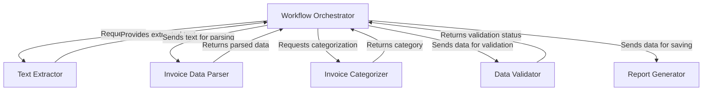
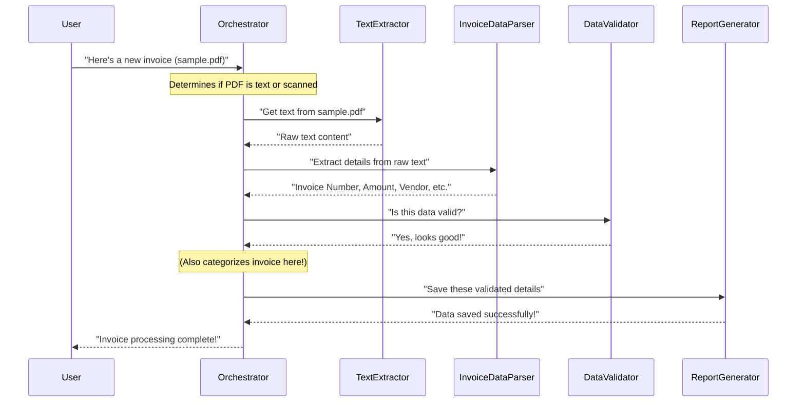

# 🧾 AI Invoice Management System

## 📌 Project Title
**AI Invoice Management System**

## 🎯 Objective
To automate the **extraction, categorization, validation**, and **reporting** of invoice details from both **text-based** and **scanned (image-based)** PDFs.

---

## 📖 Introduction

Manual entry of invoice data is tedious and error-prone, especially when invoices come in multiple formats like:
- Text-based PDFs
- Scanned image-based PDFs

This system uses **OCR** (Optical Character Recognition) and advanced **text extraction** techniques to automatically process invoices and convert them into structured, validated data.

---

## 💻 Technologies Used

| Technology   | Purpose                                  |
|--------------|-------------------------------------------|
| Python       | Core programming language                 |
| `pdfplumber` | Extract text from native PDFs             |
| `pdf2image`  | Convert scanned PDFs into images          |
| `pytesseract`| Perform OCR on images                     |
| `Pillow`     | Image preprocessing (e.g., grayscale)     |
| CSV          | Export structured data                    |

---

## 🔄 Workflow

1. **Input**: User uploads an invoice (`.pdf`)
2. **Text Extraction**:
   - ✅ If **text-based** PDF: Use `pdfplumber`
   - 📷 If **scanned**: Convert to image ➜ Use `pytesseract` (OCR)
3. **Preprocessing** *(for scanned PDFs)*:
   - Convert image to grayscale
   - Enhance contrast for better OCR
4. **Data Extraction**: Pull out:
   - Invoice Number
   - Invoice Date
   - Invoice Amount
   - Vendor Name
5. **Validation**: Ensure all fields are correctly captured
6. **Categorization**: Group by Vendor Name
7. **Reporting**: Export to `.csv`

---

## 🧠 Code Explanation

| File              | Function                                      |
|-------------------|-----------------------------------------------|
| `extract_data.py` | Text extraction or OCR from scanned invoices  |
| `process_data.py` | Extracts key invoice fields                   |
| `validate_data.py`| Verifies that required fields are present     |
| `categorize_data.py`| Categorizes invoices based on vendors       |
| `report_data.py`  | Saves processed data into a CSV               |
| `main.py`         | Coordinates and runs the entire workflow      |

---

## ✅ Advantages

- 🔁 **Automation** – Reduces manual data entry
- 🎯 **Accuracy** – Uses high-precision OCR & parsing
- ⚡ **Efficiency** – Quickly processes multiple invoices
- 📈 **Scalability** – Handles large batches with ease

---

## ⚠️ Limitations

- 🔍 **OCR accuracy** may vary based on scan quality
- 📐 **Complex layouts** (tables/columns) may require customization
- 🌐 **Language Support**: English only (for now)

---

## 🛠️ Setup Instructions

### 1. Install dependencies
```bash
pip install pdfplumber pdf2image pytesseract pillow
2. Install & configure Tesseract OCR
Download from: https://github.com/tesseract-ocr/tesseract

Add tesseract to your system PATH

project/
├── data/
│   └── invoices/    # Place your PDFs here
├── extract_data.py
├── process_data.py
├── validate_data.py
├── categorize_data.py
├── report_data.py
└── main.py

Edit
python3 main.py
📦 Final Output
✅ Structured CSV file with all invoice details

🐞 Debug logs during each processing step

🚀 Future Improvements
🤖 Integrate AI/ML for better field detection


# Tutorial: ai-invoicr-managent

This project, the **AI Invoice Management System**, *automates* the entire process of managing invoices. It can take both *regular text PDFs* and *scanned image PDFs*, intelligently extracting all the raw text from them. Then, it meticulously *parses* this text to pull out crucial details like invoice numbers, dates, and amounts. These extracted details are *validated* to ensure completeness and *categorized* based on vendors, before finally being organized and *reported* into an easy-to-use CSV file.


## Visual Overview



## Chapters

1. [Workflow Orchestrator
](01_workflow_orchestrator_.md)
2. [Text Extractor
](02_text_extractor_.md)
3. [Invoice Data Parser
](03_invoice_data_parser_.md)
4. [Data Validator
](04_data_validator_.md)
5. [Invoice Categorizer
](05_invoice_categorizer_.md)
6. [Report Generator
](06_report_generator_.md)

---

<sub><sup>Generated by [AI Codebase Knowledge Builder](https://github.com/The-Pocket/Tutorial-Codebase-Knowledge).</sup></sub>

📄 Extract detailed line-items from invoices

🌐 Build a web dashboard for uploads & analytics

📩 Contact
For support or feature requests, please raise an issue or contact the developer


# Chapter 1: Workflow Orchestrator

Welcome to the world of automated invoice management! In this first chapter, we're going to talk about a very important concept called the "Workflow Orchestrator." Don't let the fancy name scare you – it's actually quite simple and incredibly useful.

### What's the Big Idea? (The Problem)

Imagine you have a pile of invoices to process every day. Some are neat, digital PDFs that you can easily copy text from. Others are scans of paper invoices, which look like pictures, and you can't just copy text directly.

If you were doing this manually, you'd have to:
1.  **Pick up an invoice.**
2.  **Figure out:** Is it a clear text PDF or a blurry scanned image?
3.  **If text PDF:** Copy out the important details like invoice number, date, and amount.
4.  **If scanned image:** You'd have to *read* it like a human, then type out the details.
5.  **Categorize it:** "Oh, this is from 'Acme Corp', so it's an 'Office Supply' invoice."
6.  **Double-check:** Did I type everything correctly? Is anything missing?
7.  **Save it:** Put all the information into your spreadsheet or system.

This process is slow, boring, and very easy to make mistakes! Our `ai-invoicr-managent` project aims to automate all these steps. But how do we make sure all these different steps happen in the right order? That's where our "Workflow Orchestrator" comes in!

### Meet the Workflow Orchestrator: Your Project Manager

Think of the Workflow Orchestrator as the **central project manager** for processing an invoice. When a new invoice arrives, the Orchestrator takes charge. It doesn't do all the work itself, but it knows *who* should do *what* and *when*. It's like a conductor leading an orchestra, making sure each musician (each part of our system) plays their part at the right time to create beautiful music (a fully processed invoice!).

**Its main job is to:**
*   Receive an invoice.
*   Decide the first step (how to get text from it).
*   Hand off the invoice (or its text) to the next specialist for processing.
*   Keep track of the whole journey until the invoice is completely done and saved.

### How Does It Work in Our Project?

In our `ai-invoicr-managent` project, the **`main.py`** file is our Workflow Orchestrator. It contains the core logic that ties all the different parts together.

Let's look at a simplified example of how you would "tell" the Orchestrator to process an invoice:

```python
# main.py (simplified)

# Imagine these are functions from other parts of our system
# We'll learn about them in detail in later chapters!
def extract_text(pdf_path, is_scanned):
    # ... magic happens to get text ...
    print(f"Step 1: Text extracted from {pdf_path}")
    return "This is the raw text from the invoice."

def extract_details(raw_text):
    # ... more magic to find invoice number, date, etc. ...
    print("Step 2: Key details extracted.")
    return {"invoice_number": "INV001", "amount": 100.0}

def validate_data(details):
    # ... magic to check if details are valid ...
    print("Step 3: Data validated.")
    return True # No errors

def save_invoice(details):
    # ... magic to save details to a file ...
    print("Step 4: Invoice data saved.")

# This is our Orchestrator's main function
def process_invoice(pdf_file_path, is_scanned_pdf):
    print(f"Orchestrator starts processing: {pdf_file_path}")

    # 1. Get the text
    invoice_text = extract_text(pdf_file_path, is_scanned_pdf)

    # 2. Extract key details
    extracted_details = extract_details(invoice_text)

    # 3. Validate the details
    if validate_data(extracted_details):
        # 4. Save the processed invoice
        save_invoice(extracted_details)
        print("Orchestrator finished: Invoice fully processed!")
    else:
        print("Orchestrator finished: Found errors, stopping!")

# Example of how you'd use the Orchestrator:
if __name__ == "__main__":
    invoice_path = "data/invoices/sample_invoice.pdf"
    process_invoice(invoice_path, is_scanned_pdf=False)
```

**What's happening here?**

The `process_invoice` function is our Orchestrator in action.
1.  We give it the path to an invoice file (`invoice_path`) and tell it if it's a scanned PDF (`is_scanned_pdf`).
2.  The Orchestrator then calls `extract_text` to get the raw text. (This part of the work is done by the [Text Extractor](02_text_extractor_.md), which we'll explore in the next chapter!)
3.  Once it has the text, it sends it to `extract_details` to find the important bits like the invoice number and amount. (This is the job of the [Invoice Data Parser](03_invoice_data_parser_.md)).
4.  Then, it passes these extracted details to `validate_data` to ensure everything looks correct. (Done by the [Data Validator](04_data_validator_.md)).
5.  Finally, if all checks pass, it uses `save_invoice` to store the information. (This is handled by the [Report Generator](06_report_generator_.md)).

Notice how `process_invoice` itself doesn't know *how* to extract text or *how* to save data. It just knows *who* to ask for each specific task!

### The Orchestrator's Journey: A Step-by-Step Walkthrough

Let's visualize the journey of an invoice as it's processed by our Workflow Orchestrator.



In this diagram:
*   The **User** gives the invoice to the **Orchestrator**.
*   The **Orchestrator** acts as the central hub, passing the task to specialized components like the **Text Extractor**, **Invoice Data Parser**, **Data Validator**, and **Report Generator**.
*   Each component does its specific job and sends the result back to the **Orchestrator**.
*   The **Orchestrator** then decides the next step based on the previous result, ensuring a smooth flow from start to finish.

### Under the Hood: The Real `main.py`

Our project's `main.py` file is the actual Workflow Orchestrator. It imports functions from other files (`src/extract_data.py`, `src/process_data.py`, etc.) and calls them in the correct sequence.

Let's look at the actual code structure of the `process_invoice` function in `main.py`:

```python
# From main.py

# Import all the specialist functions
from src.extract_data import extract_text_from_pdf, ocr_pdf_to_text
from src.process_data import extract_invoice_data
from src.categorize_data import categorize_invoice
from src.validate_data import validate_data
from src.report_data import save_data_to_csv

def process_invoice(pdf_path, is_scanned=False):
    print(f"Processing invoice from: {pdf_path}")

    # Step 1: Extract data (calls Text Extractor)
    if is_scanned:
        print("Using OCR-based extraction...")
        text = ocr_pdf_to_text(pdf_path) # For scanned images
    else:
        print("Using regular text extraction...")
        text = extract_text_from_pdf(pdf_path) # For text PDFs
    
    print("\nExtracted Text (first few lines):\n", text[:200] + "...") # Show only a snippet

    # ... (more steps below)
```

**Explanation of this first part:**
*   We first import all the necessary "worker" functions from their respective files. This allows our Orchestrator to "call upon" them.
*   The `process_invoice` function takes the `pdf_path` and `is_scanned` as input.
*   It immediately makes a decision: If `is_scanned` is `True`, it uses `ocr_pdf_to_text` (for image-based PDFs); otherwise, it uses `extract_text_from_pdf` (for regular text PDFs). This is the Orchestrator routing the task to the correct [Text Extractor](02_text_extractor_.md).

Let's continue with the next steps of the Orchestrator:

```python
# From main.py (continued from above)

    # Step 2: Process data to get key fields (calls Invoice Data Parser)
    invoice_data = extract_invoice_data(text)
    print("\nExtracted invoice data:", invoice_data)

    # Step 3: Categorize the invoice (calls Invoice Categorizer)
    if invoice_data.get('vendor') and invoice_data['vendor'] != 'Missing':
        invoice_data['category'] = categorize_invoice(invoice_data['vendor'])
    else:
        invoice_data['category'] = 'Uncategorized'
    print(f"Invoice category assigned: {invoice_data['category']}")

    # Step 4: Validate the extracted data (calls Data Validator)
    errors = validate_data(invoice_data)
    if errors:
        print("Validation errors:", errors)
        return # Stop processing if there are errors

    # Step 5: Save the data to CSV (calls Report Generator)
    save_data_to_csv([invoice_data])
    print(f"\nProcessed and saved invoice data for Invoice Number: {invoice_data['invoice_number']}")
```

**Explanation of this second part:**
*   After getting the raw text, the Orchestrator passes it to `extract_invoice_data` from `src/process_data.py`. This is the [Invoice Data Parser](03_invoice_data_parser_.md) getting busy!
*   Then, it takes the extracted data and sends the vendor name to `categorize_invoice` from `src/categorize_data.py`. This is the [Invoice Categorizer](05_invoice_categorizer_.md) at work.
*   Next, it calls `validate_data` from `src/validate_data.py`. This is the [Data Validator](04_data_validator_.md) making sure everything is correct. If there are errors, the Orchestrator stops!
*   Finally, if all steps are successful, it calls `save_data_to_csv` from `src/report_data.py`. This is the [Report Generator](06_report_generator_.md) creating the final output.

As you can see, the `main.py` file really is the "brain" or the "central project manager" that coordinates all the different specialized parts of our system to process an invoice from start to finish.

### Conclusion

You've learned that the Workflow Orchestrator is like the project manager of our invoice processing system. Its job is to coordinate all the different steps—from getting the text out of an invoice to finally saving the processed details—making sure everything happens in the correct order. It doesn't do the individual tasks itself, but it knows which specialized component is responsible for each part of the work.

In the next chapter, we'll dive into the very first task the Orchestrator delegates: getting the text out of an invoice. This is handled by the [Text Extractor](02_text_extractor_.md)!

---

